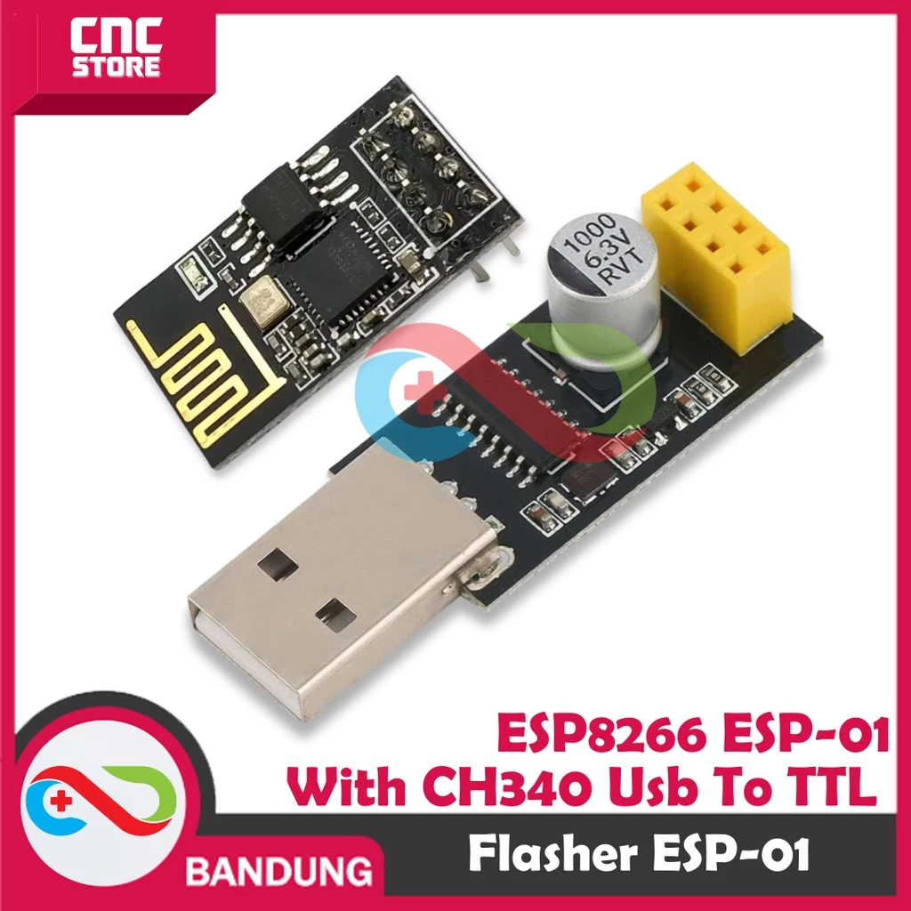

# **Komponen Utama (dekat dengan Sumber Daya Listrik)**

| No | Nama Barang                            | Harga                  | Link                                                                                                                                                                                                    | Catatan                                                     |
| -- | -------------------------------------- | ---------------------- | ------------------------------------------------------------------------------------------------------------------------------------------------------------------------------------------------------- | ----------------------------------------------------------- |
| 1  | ESP01 + Adapter                        | Rp 30.100              |                               | Untuk Mengirim Data                                         |
| 2  | Arduino Nano                           | Rp 57.900              |                                                   | Kontroller untuk mengambil data                             |
| 3  | Modem                                  | Rp 149.000             |                                               | Modul Data seluler                                          |
| 4  | Sensor pH                              | Rp224.900              |  | -                                                           |
| 5  | Sensor TDS Analog                     | Rp 116.900             |             | --                                                          |
| 6  | Water Flow Sensor (1/2 inch)           | Rp 30.000              |                       | Sesuaikan ukuran pipa  untuk menghitung debit air |
| 7  | DS18B20 SENSOR TEMPERATURE WATERPROOF  | Rp 37.500              |         | -                                                           |
| 8  | Arduino Nano IO Shield Expansion       | Rp 14.000              |      | Pin manager Kontroller                                      |
| 9  | MODULE STEP DOWN 4 OUTPUT              | Rp 60.000              |                                | Management sumber daya                                     |
| 10 | PPOWER SUPPLY ADAPTOR                  | Rp 49.500              |                                    | Sumber Daya                                                 |
| 11 | BOX ELEKTRONIK X8                      | Rp15.000               |                                               | Box untuk menyimpan modul                                   |
| 12 | 10PCS BAUT BAUD SEKRUP X 10            | Rp 15.000              |                                        |                                                             |
| 13 | Kartu Perdana IM3 Freedom Internet 3GB | Rp 35.000              |                                    | Operator Layanan Internet                                   |
| 14 | Kabel dan alat Instalasi               | Rp 200.000             |                                                                                                                                                                                                         |                                                             |
|    | **TOTAL**                        | **Rp 1.034.800** |                                                                                                                                                                                                         |                                                             |

# **Komponen Utama (Jauh dengan Sumber Daya Listrik)**

| No | Nama Barang                            | Harga                  | Link                                                                                                                                                                                                    | Catatan                                                     |
| -- | -------------------------------------- | ---------------------- | ------------------------------------------------------------------------------------------------------------------------------------------------------------------------------------------------------- | ----------------------------------------------------------- |
| 1  | ESP01 + Adapter                        | Rp 30.100              |                               | Untuk Mengirim Data                                         |
| 2  | Arduino Nano                           | Rp 57.900              |                                                   | Kontroller untuk mengambil data                             |
| 3  | Modem                                  | Rp 149.000             |                                               | Modul Data seluler                                          |
| 4  | Sensor pH                              | Rp224.900              |  | -                                                           |
| 5  | Sensor TDS Analog                     | Rp 116.900             |             | --                                                          |
| 6  | Water Flow Sensor (1/2 inch)           | Rp 30.000              |                       | Sesuaikan ukuran pipa  untuk menghitung debit air |
| 7  | DS18B20 SENSOR TEMPERATURE WATERPROOF  | Rp 37.500              |         | -                                                           |
| 8  | Arduino Nano IO Shield Expansion       | Rp 14.000              |      | Pin manager Kontroller                                      |
| 9  | MODULE STEP DOWN 4 OUTPUT              | Rp 60.000              |                                | Management sumber daya                                     |
| 10 | Paket Panel surya 30wp                 | Rp 580.000             |                                    | Sumber Daya                                                 |
| 11 | BOX ELEKTRONIK X8                      | Rp15.000               |                                               | Box untuk menyimpan modul                                   |
| 12 | 10PCS BAUT BAUD SEKRUP X 10            | Rp 15.000              |                                        |                                                             |
| 13 | Kartu Perdana IM3 Freedom Internet 3GB | Rp 35.000              |                                    | Operator Layanan Internet                                   |
| 14 | Kabel dan alat Instalasi               | Rp 200.000             |                                                                                                                                                                                                         |                                                             |
|    | **TOTAL**                        | **Rp 1.034.800** |                                                                                                                                                                                                         |                                                             |

# Konsep IoT

